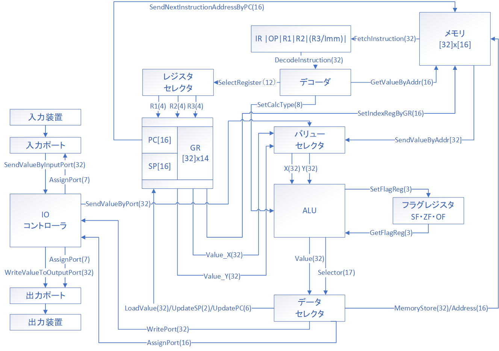

# MLFEシミュレータ

## はじめに
&emsp;MLFEシミュレータとは，NABYというCPUの命令セット,MLFEのシミュレータである．NABYはIPAの情報処理技術者試験のCOMET2を基に，32bit・RISCアーキテクチャにした設計のCPUで，その命令セットMLFEはCASL-2を基に作られている．Python3にて実装されており，MLFEで書かれたアセンブリテキストを解釈・実行するインタプリタアプリケーションである．
&emsp;コンセプトとしては，「アセンブリをプログラミング言語のように簡単に実行できるようにしていろいろいじりたい」というものである．現代のプログラミングというのは人間が理解しにくいところをブラックボックスにしていって細かいところはコンピュータパワーで何とかするという方針の下開発が進められているように思える．その開発の流れは当然で，面倒な所を機械に任せて人間はアルゴリズムやアプリの処理フローを考えるところに時間を割きたいはずだ．しかしそれだけで良いのだろうか．  
&emsp;C言語が高級アセンブリ言語と言われて久しいが，多くの人は「グローバル変数とローカル変数って具体的に何が違うんだろう？」とか「アセンブラファイルを見てみたけど，ローカルの配列って何でスタックに突っ込むんだろう？」という疑問を持たないのだろうか？持たないなら持たないで構わないのだが，その疑問に答えるような存在が居ても良いだろう．  
&emsp;このシミュレータのターゲットはコンピュータアーキテクチャを学びたい情報系の人間である．CPUアーキテクチャの説明としてよく用いられるのが，16bit・CISCのようなものが多い印象で，工学系ならともかく情報系の人間としてはピンとこない所がある．何故なら普段使っているコンピュータがそうではないから（IntelもCISCだが内部ではRISCに変換されている）．普段使っているような汎用コンピュータに近い環境のシミュレータが現状あまりないこともこのシミュレータ開発のモチベーションになっている．  
&emsp;前提としてアセンブリ言語は分かりずらいし，仮にMLFEをマスターしてもIA-32のアセンブリを見たときにビビらなくなるだけで理解できるようにはならない．でもこのシミュレータが何かのきっかけになれば良いなと思う．それでは，よろしくお願い致します．

## システムの仕様


<div align="center">
    
    <div style="text-align: center;"><b>
        図１．CPUモデル図
    </b></div>
</div>

### シミュレート環境
&emsp;想定している環境はOSが動いているうえで実行される16bitの仮想メモリが割り振られたプロセスの１つである．ハードウェアは，32bit・RISCアーキテクチャである．演算は32bit整数値のみ可能で，FPUやパイプライン，外部割り込みは無い．入出力はいわゆるI/OマップドI/Oで，専用の機械語命令を持つほか，OSにメモリをアクセスしてもらって入出力することもできる．  
&emsp;16bit割り振られているものの，事前に確保していない領域，つまり命令・データ領域とスタック領域の間の領域へのアクセスは制限されている．スタックは自由にPUSHしてその中間の領域へ延ばすことが出来るが，メモリのロードストアは出来ない．SVC命令のmallocを用いることでこの中間の領域の確保をすることが出来る  
&emsp;命令やデータ，スタックはPythonのlistで実装されているが，常に16bit(65536)個要素を持つのは現実的ではない，よって命令・データとスタックそれぞれのlistをもっており両方のlistの要素数が65536個を超えないように管理するようになっている．

### ハードウェアの仕様
(1) 1語は32bitである．  
(2) 主記憶の容量は16bit,65536語でアドレスは0から65535番地である．  
(3) 数値は基本的に32bitで2の補数で表現する.  
(4) 逐次実行で命令語は1語の固定長である．  
(5) レジスタの種類としては，汎用レジスタ，スタックポインタ，プログラムカウンタ，フラグレジスタ，命令レジスタがある．  
```
GR  汎用レジスタ，32bit取り扱うことが出来て14個ある．
SP  スタックポインタ，スタックを取り扱うためにあるレジスタ.16bitである．
PC  プログラムカウンタ，次の命令の番地が書き込まれるレジスタ．16bitである．
FR  フラグレジスタ．演算の結果でサインフラグ(SF),ゼロフラグ(ZF),オーバーフローフラグ(OF)が書き換わる．3bitである．
IR  命令レジスタ，実行する命令が書き込まれるレジスタ．32bitである．
```
(6) 入出力はポートを通して行う．入力ポートと出力ポートがある．  

## 命令
&emsp;命令とは，アセンブラやCPUなどに渡す処理の指示のことである．アセンブラ命令・マクロ命令・機械語命令・デバッグ命令の四種類がある．それぞれの命令で用いられる凡例を以下に示す  

|記号|意味|
|:-:|:-:|
|r/r1/r2/r3|レジスタを表す．GR1などが入る．|
|imm/imm1/imm2|即値を表す．10進数，16進数，文字定数が記述可能．|
|x|指標レジスタを表す．表記としてはrと同じである．|
|label|ラベル．展開時には即値に変換される．|
|(foo)|レジスタの値やラベルの示すアドレスが指す値のこと．|
|[bar]|省略可能なオプション．|
|{hoge}|2の補数としてではなくただの数値として扱う．|
|routine|SVC命令にて呼び出される外部ルーチンを表す．詳細はSVC命令にて述べる．|
|str[x:y]|x文字以上y文字以下の文字列を表す．省略したときは上限下限が無いことを表す．|
|X\|Y|要素としてXかYかどちらかが入ることを表す．|
|FR|フラグレジスタが書き換わるかどうかを示す．|
|-|フラグレジスタは書き換わらない．|
|o|フラグレジスタは書き換わる．計算結果が0のときZFが1になる．計算結果が負の数の時SFが1になる．オーバーフローしたときにはOFが1になる．他の場合はそれぞれ0になる．|
|o1|フラグレジスタは書き換わる．ただしOFは0が設定される．|
|o2|フラグレジスタは書き換わる．ただしOFはレジスタから最後に送り出されたbitが設定される．|

また，`;`はコメントを表し，以降の行の解釈を中止する．

### アセンブラ命令
&emsp;アセンブラ命令とは，アセンブラに渡す命令群のことを指す．プログラムの始まりを表す`START`やメモリ領域の確保の指示を出す`DS`などがある．

##### START
```
; START program
; プログラムの先頭を定義する．プログラムに必ず一つ必要である．
; またオペランドとしてlabelが定義されていればそこをプログラムの開始番地とする．
; FR: -
[label] START   [label]
```

##### END
```
; END program
; プログラムの記述が終了したことを表す．プログラムに必ず一つ必要である．
; このアドレスを命令として読むとエラーが発生する．
; FR: -
[label] END
```

##### DS
```
; Define Space
; imm語分データ領域を確保し，0で初期化する．
; シミュレータ上では確保した領域のオペコードはDATAになり，命令として読むとエラーが発生する．
; FR: -
[label] DS      imm

; 使用例
BUF     DS      256
```

##### DC
```
; Define Constant
; immを32bit整数，または文字列としてデータに展開する．
; シミュレータ上では確保した領域のオペコードはDATAになり，命令として読むとエラーが発生する．
; FR: -
[label] DS imm | str[1:]

; 定義できるデータは10進数，16進数，文字列，アドレス定数がある．
labelA  DC      10
labelB  DC      #A
labelC  DC      'Hello'
labelD  DC      labelA      ; labelAのアドレスが格納されている．
; 文字列を定義した時，ラベルは文字列の先頭のアドレスが格納されている．

; オペランドに =immと指定することで即値のように記述することが出来る．
; 内部処理としてはDCが実行されている．
GREET   OUT     ='Hello\n', =6
```


### マクロ命令
&emsp;マクロ命令とは，アセンブラによって機械語命令に展開される命令群のことを指す．メモリのデータを出力する`OUT`，いくつかのレジスタを一気にスタックに積む`RPUSH`などがある．

##### IN
```
; IN from input port
; label1に書き込むメモリの番地の始め，label2に読み込むデータの長さを入れる．
; 入力された文字列は一文字ずつ数値として書き込まれていく．
; FR: -
[label] IN      label1, label2

;使用例
FUNC    IN      BUFF, LEN
BUFF    DS      16
LEN     DC      16

```

##### OUT
```
; OUT to write port
; label1に読み込むアドレス，label2に書き込むデータの長さ，label3に標準出力にどんなフォーマットで出すかを指定する．
; FR: -
[label] OUT     label1, label2[, label3]

; 使用例
FUNC    OUT     BUFF, LEN, MODE
BUFF    DC      'Helloworld\n'
LEN     DC      11
MODE    DC      0

; MODEは数字で指定する．
; 0 -> デフォルトモード．文字として解釈する．label3を指定しなかったときはこれになる．
; 1 -> 10進数モード
; 2 -> 16進数モード
; 3 -> 2進数モード
; 4 -> 符号なし10進数モード
; 他の値 -> デフォルト．
```

##### RPUSH
```
; Repeat PUSH
; 指定した複数のレジスタをスタックにプッシュする．
; 無指定ではGR1からGR7の値をスタックにプッシュする．
; FR: -
[label] RPUSH   [imm1, imm2]

; 使用例
; GR1からGR3に値をスタックにプッシュ．
FUNC    RPUSH   1, 3
```

##### RPOP
```
; Repeat POP
; 指定した複数のレジスタにスタックからポップした値を入れる．
; 無指定ではGR7からGR1へスタックからポップした値を入れる．
; FR: -
[label] RPOP    [imm1, imm2]

; 使用例
; GR3からGR1へスタックからポップした値を入れる．
FUNC    RPOP    1, 3
```

##### RANDINT
```
; RANDom INTeger
; 指定した数字の範囲で疑似乱数を生成する．
; 実行後，フラグレジスタの値は
; 左オペランドをa, 右オペランドをbとしたとき，
; a <= b -> ZF is 1
; a > b  -> SF is 1
[label] RANDINT [imm1, imm2]

; imm1とimm2を指定したとき
; imm1 <= x < imm2の範囲で疑似乱数が返される
; 指定されなかったとき
; GR1 <= x < GR2の範囲で返される
; 結果はGR0に格納される
; a < b ではなかったとき，GR0には-1が格納される．

; 使用例

PGM     START
        RANDINT 1, 5
        LAD     GR1, 1
        WRITE   GR1, GR0
        RET
        END

```

##### ABS
```
; ABSolute value
; 指定したレジスタの値を絶対値にします。
; フラグは全てFalseになります。
[label] ABS     r

PGM     START
        SUBA    GR1, =5
        ABS     GR1
        RET
        END

```

##### SOUND
```
; SOUND output
; 再生時間(ミリ秒)、周波数(Hz)、サンプリング周波数(Hz)を指定してその音を出力します。
; windows環境のみサポートします。
[label] SOUND   adr1, adr2, adr3

PGM     START
        SOUND   TIME, FREQ, SAMPL
        RET
TIME    DC      250
FREQ    DC      440
SAMPL   DC      44100
        END

; Posix環境で動かすためには
;
; このTipsを参照。
```

### 機械語命令
&emsp;機械語命令とは，CPUに処理の指示を出す命令群のことを指す．形式は32bit固定長で以下に示されるものである．  

```
OP オペコード, R1|R2|R3 レジスタ, Immediate 即値, Reserved 不使用
```

<table>
    <tr>
        <th>0-7</th><th>8-11</th><th>12-15</th>
        <th>16-19</th><th>20-31</th>
    </tr>
    <tr>
        <td align="center">OP</td>
        <td align="center">R1</td>
        <td align="center">R2</td>
        <td align="center">R3</td>
        <td align="center">Reserved</td>
    </tr>
    <tr>
        <td align="center">OP</td>
        <td align="center">R1</td>
        <td align="center">R2</td>
        <td colspan=2 align="center">Immediate</td>
    </tr>
</table>

#### ロード・ストア命令

##### LD
```
; LoaD
; レジスタに値を読み込ませる．
[label] LD      r1, r2          ; r1 <- (r2)
[label] LD      r, label[, x]   ; r <- (label [+ (x)])

; 使用例
; TEXTの2文字目をGR1に格納する．
FUNC    LD      GR2, =1
        LD      GR1, TEXT, GR2
TEXT    DC      'abcde'
```

##### LAD
```
; Load ADdress
; レジスタに即値を読み込ませる．
; 即値は16bit算術値として読み込まれる．
; つまり32bitレジスタに読み込ませる上で，
; 即値の最上位ビットを残りの16bitにパディングする．
; FR: -
[label] LAD     r, imm[, x]     ; r <- imm [+ (x)]

; 以下のアセンブリは動作としてはほとんど同じだが，DCを使っているか否かの差がある．
X       LD      GR1, =5
Y       LAD     GR1, 5
```

##### ST
```
; STore
; レジスタの値をメモリに格納する．
; FR: -
[label] ST      r, label[, x]   ; (r) -> (label [+ (x)])

;使用例
FUNC    LAD     GR1, 5
        ST      GR1, BUFF
BUFF    DS      1
```

#### 四則演算演算命令
&emsp;四則演算命令とは加減乗除を実現する命令である．ディスティネーションはレジスタのみだが，ソースはレジスタかメモリどちらでも指定することが出来る．この命令には算術的な計算と論理的な計算がある．算術的な計算とはbit列を2の補数として計算する．論理的な計算とはbit列をただの数値として計算する．

##### ADDA, SUBA, MULA, DIVA
```
; ADDition Arithmetic
; SUBtractin Arithmetic
; MULtiplication Arithmetic
; DIVision Arithmetic
; FR: o
; −2,147,483,648から2,147,483,647の間で計算する．
; 計算結果がオーバーフローを起こし，OFに変化を与える．
; 以下ADDAを例に説明．

[label] ADDA    r1, r2          ; r1 += (r2)
[label] ADDA    r1, r2, r3      ; r1 = (r2) + (r3)
[label] ADDA    r, label[, x]   ; r += (label [+ x])

; 使用例
FUNC    LAD     GR1, 2147483647
        ADDA    GR1, ONE
        JOV     OVER
        RET
OVER    OUT     ='Overflow\n', =9
        RET
ONE     DC      1
```

##### ADDL, SUBL, MULL, DIVL
```
; ADDition Logical
; SUBtractin Logical
; MULtiplication Logical
; DIVision Logical
; FR: o
; 0から4,294,967,295の間で計算する．
; 計算結果がオーバーフローを起こし，OFに変化を与える．
; 以下ADDLを例に説明．

[label] ADDL    r1, r2          ; r1 += {(r2)}
[label] ADDL    r1, r2, r3      ; r1 = {(r2) + (r3)}
[label] ADDL    r, label[, x]   ; r += {(label [+ x])}
```

#### 論理演算命令

##### AND, OR, XOR
```
; AND 論理積
; OR 論理和
; XOR 排他的論理和
; FR: o1
; 以下ANDを例に説明．
[label] AND     r1, r2          ; r1 <- {(r1)},{(r2)}の論理積
[label] AND     r, label[, x]   ; r <- {(r)},{(label [+ x])}の論理積
```

#### 比較演算命令
&emsp;比較演算命令は，左が大きかった時は正，等しかった時は0，右が大きかった時は負が計算結果として出たときと同様にフラグにセットする命令．算術的な計算と論理的な計算で演算結果が異なる．

|比較結果|SF|ZF|
|:---:|:-:|:-:|
|a > b|0|0|
|a==b |0|1|
|a < b|1|0|

##### CPA, CPL
```
; ComPare Arithmetic 算術比較
; ComPare Logical 論理比較
; FR: o1
; 以下CPAを例に説明．
[label] CPA     r1, r2          ; a <- (r1), b <- (r2), a<=>b
[label] CPA     r, label[, x]   ; a <- (r), b <- (label [+ x]), a<=>b
```


#### シフト演算命令
##### SLA, SRA
```
; Shift Left Arithmetic  算術左シフト
; Shift Right Arithmetic 算術右シフト
; 算術シフト 符号を除き(r)を実行アドレスで指定したbit数だけ左または右にシフトする.
; シフトの結果は,空いたbit位置には,左シフトの時は0,右シフトの時は符号と同じものが入る.
; 以下SLAを例に説明．
[label] SLA     r, imm[, x]     ; rをimm[+x]分，算術左シフト

; GR1の値をGR2の値左シフト
FUNC    LAD     GR1, 1
        LAD     GR2, 3
        SLA     GR1, 0, GR2
```

##### SLL, SRL
```
; 論理シフト 符号を含み(r)を実行アドレスで指定したbit数だけ左または右にシフトする.
; シフトの結果,空いたbit位置には0が入る.
; Shift Left Logical
; Shift Right Logical
; 以下SLLを例に説明．
[label] SLL     r, imm[, x]     ; rをimm[+x]分，論理左シフト
```

#### 分岐命令
&emsp;フラグレジスタの状態でアドレスをプログラムレジスタに入れるか入れないかをきめる．分岐しないときは次の命令に進む．

|命令|OF|SF|ZF|
|:-:|:-:|:-:|:-:|
|JPL| |0|0|
|JMI| |1| |
|JNZ| | |0|
|JZE| | |1|
|JOV|1| | |

JUMPは必ず分岐する．

##### JPL, JMI, JNZ, JZE, JOV, JUMP
```
; Jump on PLus
; Jump on MInos
; Jump on Non Zero
; Jump on ZEro
; Jump on Overflow
; unconditional Jump
; FR: -
; 以下JZEを例に説明．
[label] JZE     label[, x]      ; PC <- ZF ? label : PC+1

; レジスタが同じ値の時に'Equal'を出力
FUNC    LAD     GR1, 10
        LAD     GR2, 10
        CPA     GR1, GR2
        JZE     EQUAL
        OUT     ='NotEqual', =8
        RET
EQUAL   OUT     ='Equal', =5
        RET
```

#### スタック演算命令

##### PUSH
```
; PUSH stack
; スタック領域に即値のプッシュを行う．
; FR: -
[label] PUSH    imm[, x]
; SP <- (SP) - 1
; (SP) <- imm [+ x]

; GR1の値をスタックにプッシュ．
FUNC    PUSH    0, GR1
```

##### POP
```
; POP stack
; スタックからポップを行い，レジスタにその値を格納する．
; FR: -
[label] POP     r
; r <- (SP)
; SP <- (SP) + 1

; スタックからポップした値をGR1に格納
FUNC    POP     GR1
```

#### コール,リターン,入出力,その他

##### CALL
```
; CALL subroutine
; スタックにPCの値をプッシュしてから，指定されたアドレスに移動する．
; FR: -
[label] CALL    label[, x]
; SP <- (SP) - 1
; (SP) <- (PC)
; PC <- label [+ x]
```

##### RET
```
; RETurn from subroutine
; スタックをポップし，その値をPCに入れる．
; FR: -
[label] RET
; PR <- (SP)
; SP <- (SP) + 1
```

##### READ
```
; READ from port
; 入力ポートから読み込み，レジスタに格納
; FR: -
[label] READ    r1, r2 [, label]
; r1 [+ (label)] 番入力ポートから値を読み込み，r2に書き込む
; 入力は入力バッファから読みだしていく方式で，非同期である．
; 入力バッファが空白，つまり何も入力されていないときr1には0が書き込まれる．
; 他ポートに関してはサブプログラムのport_mlfeにて記述する．

; 使用例
FUNC    LAD     GR1, 0
        LAD     GR2, 0
        READ    GR1, GR2
        RET
```

##### WRITE
```
; WRITE to port
; レジスタの値を出力ポートへ書き込み
; FR: -
[label] WRITE   r1, r2 [, imm]
; r1 [+ (label)] 番出力ポートへr2の値を書き込む．
; 0 -> 文字出力
; 1 -> 10進数出力
; 2 -> 16進数出力
; 3 -> 2進数出力
; 4 -> 符号なし10進数出力
; 他ポートに関してはサブプログラムのport_mlfeにて記述する．

; 使用例
PGM     START
        LAD     GR4, 63
        LAD     GR0, 0
        LAD     GR1, 1
        LAD     GR2, 2
        LAD     GR3, 3
        OUT     ='C: ', =3
        WRITE   GR0, GR4
        OUT     ='\nD: ', =4
        WRITE   GR1, GR4
        OUT     ='\nX: ', =4
        WRITE   GR2, GR4
        OUT     ='\nB: ', =4
        WRITE   GR3, GR4
        RET
        END
; C: ?
; D: 63
; X: 3f
; B: 111111
```


##### SVC
```
; Super Visor Call
; カーネルの機能を呼び出し，レジスタやメモリの操作を行わせる命令．
; 本実装においては，専用のモジュールスクリプトを用いて行う
; 呼び出し後のフラグの値は不定である．
; 詳細はサブプログラムのsvc_mlfeに示す．
[label] SVC     routine

; 使用例
GETTIME SVC     time
```

##### NOP
```
; No Operation
; 何もしない．
; FR: -
[label] NOP
```


###デバッグ命令
&emsp;デバッグ命令とは，本シミュレータ環境でのみ実装するデバッグの為の高機能な命令で，レジスタの状態を表示する`DREG`，指定したレジスタを退避する`SAVE`などがある．

##### DREG
```
; Debug REGister with message
; 8文字の文字列とレジスタの内容を表示する.
; 汎用レジスタ，フラグレジスタ，プログラムカウンタ，スタックポインタの内容を表示する．
[label] DREG label
; 使用例
DEBUG   DREG    ='DebugReg'
; DebugReg
; GR    = [0, 0, 0, 0, 0, 0, 0, 0, 0, 0, 0, 0, 0, 0, 0, 0]
; FLAG  = [SF:False, ZF:False, OF:False]
; PC,SP = [3, 65534]
```

##### DMEM
```
; Debug MEMory with message
; 8文字の文字列と指定されたメモリの内容を表示する.
; label2で示すアドレスからlabel3で示すアドレスまで10進数値と文字で表示する．
[label] DMEM label1, label2, label3
; 使用例
PGM     START
        DMEM    ='DebugMEM',DATA_S,DATA_E
        RET
DATA_S  DC      'hello'
DATA_E  DC      10
        END

; 実行結果
; DebugMEM Start:3 End:8
;   [00003  104 h]
;   [00004  101 e] [00005  108 l] [00006  108 l] [00007  111 o]
;   [00008   10  ]
; 
```

##### DSTK
```
; Debug STacK with message
; 8文字の文字列とスタックの内容を表示する．
; 
[label] DSTK    label

; 使用例
; 表示は生のアドレス値
DEBUG   DSTK    ='DebugSTK'
; DebugSTK
;   65534: 1
;   65535: -1
```

##### SAVE
```
; SAVE registers
; サブルーチンの初めにレジスタの退避を行う命令で,
; START命令とレジスタのPUSH命令を組み合わせたもの.プログラム終了命令RETURNと主に用いる.

[label] SAVE ALL | GRx[, GRy, ...]

; ALL GR1からGR15まで退避
; レジスタ指定 指定されたレジスタを退避

; 実装は，指定されたレジスタを左のレジスタから順々にレジスタの内容とアドレス(添え字)を順々にスタックに格納していって,
; 最後に,格納したレジスタの個数をスタックにPUSHしたら終了する.

; 使用例
FUNC    SAVE    GR1, GR3, GR10
```

##### RETURN
```
; RETURN with recovery
; サブルーチンの終わりにレジスタの回復とRETを行う命令で,
; POP命令とRETを組み合わせたものである.

[label] RETURN

; 実装としては,
; (1) スタックをポップ,これを何個レジスタを回復するかという個数として扱う
; (2) スタックをポップ,これはレジスタのアドレス(添え字)なので,レジスタを指定する.
; (3) スタックをポップ,これは(2)で指定されたレジスタの内容なのでレジスタに入れる
; (4) (1)で求めた個数分(2)(3)をループする.
; (5) 最後にスタックをポップ,CALLでスタックに入れられた戻るアドレス番地が記述されているので,もどり次の命令を実行する.

; 使用例
FUNC    RETURN
```

## データ
&emsp;NABYで取り扱うデータは，32bitのみである．それを整数値や文字として扱うことで表現している．また，使用できるエスケープシーケンスは以下のものである．

|エスケープシーケンス|意味|ASCIIコード|
|:--:||:-:|
|\\\\|バックスラッシュ(\\)|92|
|\'  |コーテーション(')|39|
|\"  |ダブルコーテーション(")|34|
|\a  |ビープ音(端末依存)|7|
|\b  |バックスペース|8|
|\f  |フォームフィード|12|
|\n  |ラインフィード|10|
|\r  |キャリッジリターン|13|
|\t  |水平タブ|9|
|\v  |垂直タブ|11|
|\e  |エスケープ|27|
|\0  |ヌル文字|0|

## エラー
&emsp;MLFEシミュレータは様々なエラーが定義されており、シミュレータの動作を停止する。ここでは定義されているエラーについて記述する。

|エラーメッセージ|内容|備考|
|:--------:|:-:|:--:|
|Do not write Stack Pointer|スタックポインタに値を書き込むことは出来ない。|プログラムは<br>停止しない|
|Do not write Program Counter|プログラムカウンタに書き込むことは出来ない。|プログラムは<br>停止しない|
|Memory access failed|利用できないメモリにアクセスしている。||
|Option format error|オプションで利用不可能なフォーマット指定をしている。||
|Interrput Program|trace-lineやdry-assembly出力中に[Ctrl+C]された。||
|Memory empty or length over 16bit|メモリに展開した後、空だったか65535語を超えている。||
|Error raised|何かのエラーが発生した。||
|Something wrong in XXX|内部のXXX関数でエラーが発生した。||
|XXX apper. Program exit|ENDとかDATA行を命令として読み込んだ。||
|Stack Empty Error|スタックが空なのにPOPされた。||
|KeyboardInterrput|READ中に[Ctrl+C]された||
|Port Not Found|WRITE, READの中で指定ポートが存在しなかった。||
|XXX opecode is wrong|XXXのオペランド指定が誤っている。||
|X String error|Xの行の文字列が閉じられていない。||
|Same label is defined|同じラベルが定義されている。||
|Label line is blank|ラベルが定義されている行が空である。||
|Length of string is zero|文字列の長さが0である。||
|#XXX is Invalid literal to hex|16進数として読み込むことが出来ない。||
|Immediate value is a 16bit arithmatic value|即値は10進数符号付き16bitの値である。||
|This character can not be included in 16bit|文字が16bitに収まらない。||
|The immediate value can not contain a string|即値の場所に文字列が記述されている。||
|Data is a 32bit arithmatic value|データ行は32bitである。||
|There is a line with not instruction|命令でもデータでも無い行がある。||
|START and END are required one by one|STARTとENDは必ず1つずつ必要である。||
|Uncorrect escape sequence|正しくないエスケープシーケンスである。||
|Invalid Definition No Data Defined|データ定義が空になっている||
|Invalid Definition Multiple Data Defined|データ定義に複数の値が記述されている||
|This Label have not been Resolved by Name|存在しないラベルがあり名前解決されていない||
|A non-integer value was returned from port X|ポートXから整数値では無い値が返された。||
|Some Error has occurd|その他のエラーが発生した。||


## その他
(1) アセンブラによって生成される命令語や領域の相対位置は,アセンブリ言語での記述順序とする.ただし,文字列や`=`から生成されるDC命令は,END命令の直前にまとめて配置される.  
(2) 生成された命令語,データは連続した領域を占める.  
(3) アセンブラは未定義ラベルをエラーとして検出し,そこでエラーメッセージを出力して実行は終了する.  
(4) プログラムは起動時にスタックの初期化として-1だけ入っている状況となっている.RET命令で-1が返されるとそこでプログラムは実行を終了する.  
(5) プログラムの実行に関して,本文によって定義がなされていないものは,未定義実行とし処理系に依存するものとする.  


## プログラムの実行
&emsp;プログラムの実行はPython3環境にて実行される．
```
> python mlfe.py hello.fe
```
(1) 実行中の命令の追跡
```
> python mlfe.py hello.fe --trace-line [--format]
> python mlfe.py hello.fe -t [--format]
```

(2) 実行前に展開された命令・データの表示
```
> python mlfe.py hello.fe --show-assembly [--format]
> python mlfe.py hello.fe -s [--format]
```

(3) データの展開かつ命令の追跡
```
> python mlfe.py hello.cas -a [--format]
```

(4) 1命令の時間の設定(秒単位)
```
> python mlfe.py hello.fe --clock-speed 0.5
> python mlfe.py hello.fe -c 0.5
```

(5) データの展開だけして実行しない
```
> python mlfe.py hello.fe --dry-assembly [--format]
> python mlfe.py hello.fe -d [--format]
> python mlfe.py hello.fe --dry-assembly --format row
> python mlfe.py hello.fe -d [--format] row
rowは何行表示するかどうかを制御することが出来るオプション
```


(6) バージョン情報の出力
```
> python mlfe.py --version
> python mlfe.py -v
```

(7) ヘルプ
```
> python mlfe.py --help
> python mlfe.py -h
```

(8) 数値の表記の設定
```
--format := (-d | -x | -b)
      -d :  10進数表記
      -x :  16進数表記
      -b :  2進数表記
```

## サブプログラム
ここでは付随するプログラムである`svc_mlfe.py`、`macro_mlfe.py`、`port_mlfe.py`について述べる．ちなみに、読み込むモジュールを切り替えたいときは`mlfe.py`プログラムの先頭にある文字列を変更すれば切り替えることが出来る。

例えばlibディレクトリのsvc_mlfe_copy.pyを読み込ませるときは
```
svc_mlfe_path = "lib.svc_mlfe_copy"
```
と記述する。

### svc_mlfe
&emsp;ここでは，SVC命令の使い方と実装の追加をしたいときの為にルールについて示す．

##### time
&emsp;レジスタに現在の時間を入れる.
```
; SVC time
; GR0 <- 処理の可否(成功なら0)
; GR1 <- ミリ秒
; GR2 <- 秒
; GR3 <- 分
; GR4 <- 時間
; GR5 <- 日
; GR6 <- 月
; GR7 <- 年

PGM     START
        SVC     time
        DREG    ='*ShowNow'
        RET
        END

; *ShowNow
; GR    = [0, 41285, 39, 16, 12, 5, 6, 2021, 0, 0, 0, 0, 0, 0]
; FLAG  = [SF:False, ZF:False, OF:False]
; PC,SP = [2, 65535]
```

##### scanf
&emsp;レジスタにバッファ,フォーマットを入れることで書式付きの入力が出来るサブルーチン.入力フォーマットに関わらず最後に0を区切り文字として書き込む.
```
; GR1 -> 書き込むメモリの先頭アドレス
; GR2 -> 入力フォーマット
;
; GR0 <- 処理の可否(成功らな0,失敗なら1)

; <使用例1>
PGM     START
        LAD     GR1,    BUFF
        LD      GR2,    FORMAT
        SVC     scanf
        SVC     printf
        RET
BUFF    DS      32
FORMAT  DC      's'
        END
; 32語分まで格納することが出来る


; FORMAT : {
;    'd' -> 10進数表現
;    'x' -> 16進数小文字表現
;    'X' -> 16進数大文字表現
;    'b' -> 2進数表現
;    'c' -> 文字
;    's' -> 文字列
; }
```

##### printf
&emsp;レジスタにバッファ,フォーマット,パディング長を与えることで書式付き出力が出来るサブルーチン.文字列出力の際は,OUT命令のように長さを与えるのではなく,数値の0を区切り文字としてそこまでを読んでいく.区切り文字が見つからなかったときは出力しない．
```
; GR1 -> 読み込むメモリの先頭アドレス
; GR2 -> 出力フォーマット
; GR3 -> 文字の長さのパディング調節
; 
; GR0 <- 処理の可否(成功らな0,失敗なら1)

; <使用例1>
PGM     START
        LAD     GR1,    BUFF
        LD      GR2,    FORMAT
        SVC     printf
        RET
BUFF    DC      'HelloWorld\n\0'
FORMAT  DC      's'
        END
; HelloWorld
;

; <使用例2>
PGM     START
        LAD     GR1,    BUFF
        LD      GR2,    FORMAT
        LD      GR3,    PADDING
        SVC     printf
        RET
BUFF    DC      2748
FORMAT  DC      'x'
PADDING DC      4
        END
; 0abc

; FORMAT : {
;    'd' -> 符号有10進数表現
;    'u' -> 符号無10進数表現
;    'x' -> 16進数小文字表現
;    'X' -> 16進数大文字表現
;    'b' -> 2進数表現
;    'c' -> 文字
;    's' -> 文字列
;    'p' -> アドレスポインタ
; }
```

##### malloc
&emsp;実行装置に有効メモリ範囲の拡張を命令するサブルーチン．やっていることはプログラム内でDS命令を実行しているのと同じ．メモリの範囲が16bitを超えると失敗する．
```
; GR1 -> 確保するメモリの個数
; GR0 <- 確保したメモリの先頭番地．失敗すると0をが入る．
[label] SVC     malloc

; 使用例
PGM     START
        LAD     GR1, 1
        LAD     GR10, 36
        SVC     malloc
        WRITE   GR1, GR0        ; 確保したアドレスの先頭番地を出力
        OUT     ='\n', =1
        ST      GR10, 0, GR0
        LD      GR5, 0, GR0
        WRITE   GR1, GR5        ; mallocで確保した領域に格納した値の出力
        RET
        END
; 32
; 36
```

#### svc_mlfe.py
&emsp;上記の標準SVC命令はsvc_mlfe.pyに記述されている．機能追加したいときの為にいくつかのルールを示す．  
(1) 機能追加したらスクリプトの下部にある`subroutines`に追加した命令を辞書形式で記述する．  
(2) 命令は関数で宣言する．引数はレジスタを表すregとメモリ領域を表すdataで統一する．  
(3) グローバル変数としては`subroutines`のみとし，変数宣言やモジュールインポートはそれぞれの関数内で完結させる．
  
### macro_mlfe
&emsp;ここでは，マクロがどのようなアルゴリズムのもと実装されているかの簡単な解説と，マクロの追加実装の為のルールについて示す．

##### IN
&emsp;IN命令はREAD命令とループ構造を用いてメモリに書き込んでいるマクロ命令である．
```
; (1) レジスタを4つ用意する．つまりレジスタ退避と初期化
;       G0 <- モード指定
;       G1 <- 長さ
;       G2 <- 読み込んだ文字のバッファレジスタ
;       G3 <- ループインデックス
; (2) G1とG3を比較して，同じだったらループの終了．(6)へジャンプ．
; (3) G2に読み込みバッファメモリに書き込み．
; (4) G3をインクリメント．
; (5) (2)へジャンプ．
; (6) 退避させていた値をレジスタにプッシュ．命令終了．

; 書き下すと以下のようになる．

PGM     START   MAIN
        RET
MAIN    CALL    _IN
        OUT     BUF, LEN, MODE
        RET
_IN     PUSH    0, GR0
        PUSH    0, GR1
        PUSH    0, GR2
        PUSH    0, GR3
        LD      GR0, =0
        LD      GR1, =0
        LD      GR3, =1
LOOP    CPL     GR1, LEN
        JZE     LOOPEND
        READ    GR0, GR2
        ST      GR2, BUF, GR1
        ADDL    GR1, GR3
        JUMP    LOOP
LOOPEND POP     GR3
        POP     GR2
        POP     GR1
        POP     GR0
        RET
BUF     DS      10
LEN     DC      10
MODE    DC      0
        END
```

##### OUT
&emsp;OUT命令はWRITE命令とループ構造を用いてメモリ内容を出力するマクロ命令である．  
```
; (1) レジスタを3つ用意する．つまりレジスタ退避と初期化
;       G0 <- モード指定
;       G1 <- ループインデックス
;       G2 <- 読み込んだ文字のバッファレジスタ
; (2) G1と長さを比較して，同じだったらループの終了．(6)へジャンプ．
; (3) G2に読み込みバッファメモリに書き込み．
; (4) G1をインクリメント．
; (5) (2)へジャンプ．
; (6) 退避させていた値をレジスタにプッシュ．命令終了．

; 書き下すと以下のようになる．

PGM     START   MAIN
        RET
MAIN    CALL    _OUT
        RET
_OUT    PUSH    0, GR0
        PUSH    0, GR1
        PUSH    0, GR2
        LD      GR0, MODE
        LD      GR1, =0
LOOP    CPL     GR1, LEN
        JZE     LOOPEND
        LD      GR2, BUF, GR1
        WRITE   GR0, GR2
        ADDL    GR1, =1
        JUMP    LOOP
LOOPEND POP     GR2
        POP     GR1
        POP     GR0
        RET
BUF     DC      'HelloWorld'
LEN     DC      10
MODE    DC      0
        END
```

##### RPUSH
&emsp;RPUSH命令は指定された分だけ連続にレジスタをプッシュする命令である．RPOPと対応するように作られている．
```
; 以下の同じラベルの命令は同一である．

FUNCX   RPUSH   1, 4
FUNCX   PUSH    0, GR1
        PUSH    0, GR2
        PUSH    0, GR3
        PUSH    0, GR4

FUNCY   RPSUH   3, 0
FUNCY   PUSH    0, GR3
        PUSH    0, GR2
        PUSH    0, GR1
        PUSH    0, GR0

FUNCZ   RPUSH   5, 5
FUNCZ   PUSH    0, 5

FUNCW   RPUSH
FUNCW   PUSH    0, GR1
        PUSH    0, GR2
        PUSH    0, GR3
        PUSH    0, GR4
        PUSH    0, GR5
        PUSH    0, GR6
        PUSH    0, GR7

```

##### RPOP
&emsp;RPOP命令は指定された分だけ連続にレジスタをプッシュする命令である．RPUSHと対応するように作られている．
```
; 以下の同じラベルの命令は同一である．

FUNCX   RPOP    1, 4
FUNCX   POP     0, GR4
        POP     0, GR3
        POP     0, GR2
        POP     0, GR1

FUNCY   RPOP    3, 0
FUNCY   POP     0, GR0
        POP     0, GR1
        POP     0, GR2
        POP     0, GR3

FUNCZ   RPOP    5, 5
FUNCZ   POP     0, 5

FUNCW   RPOP
FUNCW   POP     0, GR7
        POP     0, GR6
        POP     0, GR5
        POP     0, GR4
        POP     0, GR3
        POP     0, GR2
        POP     0, GR1

```

##### RANDINT
&emsp;RANDINT命令は，Xorshiftという疑似乱数生成アルゴリズムを実装した命令である．シード値は現在の時刻から大きい数字をつくってシード値として用いている．Xorshiftとは，4つシード値とXOR演算とシフト演算さえできればそこそこな乱数が生成することが出来るアルゴリズムである．

```
; 書き下すと以下のようになる
PGM     START
        CALL    MAIN
        RET
MAIN    LAD     GR1, 5
        LAD     GR2, 2
        CALL    RANDINT
        LAD     GR2, 1
        WRITE   GR2, GR0
        RET
RANDINT LAD     GR0, 0
        SUBA    GR0, =1
        CPA     GR2, GR1
        JMI     RANDRET
        RPUSH   1, 7
        PUSH    0, GR1
        PUSH    0, GR2
        SVC     time
        ST      GR2, S
        MULA    GR6, GR1
        ST      GR6, X
        MULA    GR5, GR1
        ST      GR5, Y
        MULA    GR4, GR1
        ST      GR4, Z
        MULA    GR3, GR1
        ST      GR3, W
        POP     GR2
        POP     GR1
        LD      GR6, S
RANDLP  CPA     GR6, =0
        JZE     RANDED
        LD      GR3, X
        SLL     GR3, 11
        XOR     GR3, X
        LD      GR4, Y
        ST      GR4, X
        LD      GR4, Z
        ST      GR4, Y
        LD      GR4, W
        ST      GR4, Z
        SRL     GR4, 19
        XOR     GR4, W
        LD      GR5, GR3
        SRL     GR5, 8
        XOR     GR3, GR5
        XOR     GR4, GR3
        ADDA    GR4, GR1
        DIVA    GR5, GR4, GR2
        MULA    GR5, GR2
        SUBA    GR0, GR4, GR5
        SUBA    GR6, =1
        JUMP    RANDLP
RANDED　RPOP    1, 7
RANDRET RET
X       DC      0
Y       DC      0
Z       DC      0
W       DC      0
S       DC      0
ZERO    DC      0
        END

```


#### macro_mlfe.py
&emsp;上記の標準マクロはmacro_mlfe.pyに記述されている．機能追加したいときの為にいくつかルールを示す．  
(1) 機能を追加したらスクリプト上部のEnumクラス`Macros`と`expand_macros`関数内の`macros`に記述する．  
(2) それぞれのマクロは関数で定義する．その関数は以下の引数と返却値が期待されている．  
```
MACRO(number: int, list_macro: list, isLabeled: bool) -> expanded: list, label: dict
number: そのマクロが呼ばれたアドレス
list_macro: そのマクロの行
isLabeled: マクロにラベルがあるかどうか
expanded: マクロ展開後のアセンブリ
label: 展開後のアセンブリに含まれるラベルと行の対応配列
```
(3) マクロ内でマクロの呼び出しは出来ない．  
(4) マクロ内で=DC呼び出しは出来ない．  
(5) データとかも素直に展開するのでデータ行が読み込まれないように注意する．  
(6) ラベルを抽出する関数`get_label`があるので活用する．  
(7) 変数宣言やモジュールインポートは関数内で完結するようにする．  


### port_mlfe
ここでは、`READ`や`WRITE`命令で用いる入出力ポートについてとそれらを定義できるサブプログラムについて述べる。

#### 入力ポート

ここでは`READ`命令で用いる入力ポートについて述べる。

##### 0 標準入力

入力ポート0は標準入力を取り込むためのポートである。文字を標準入力から受け取り一文字ずつ与える。入力が無かったら0を返す。具体的な使い方については機械語命令の`READ`に詳しい。

##### 10, 11 キーボードイベント入力

入力ポート10と11はキーボードイベントが入力されるポートである。

入力ポート10はキーボードが押されているかを与える。押されていたら1、押されていなかったら0が入力される。

入力ポート11は押されているキーを与える。押されていたらそのキーを示す番号を、押されていなかったら-1が入力される。

以下はキーイベントを待ちつつ入力されたらその文字を印字し改行するプログラムである。[Ctrl+C]でループを抜けることが出来る。

```
PGM     START
        LAD     GR2, 0
        LAD     GR10, 10
        LAD     GR11, 11
        
LOOP    READ    GR10, GR0
        CPA     GR0, FALSE
        JNZ     LOOP
        READ    GR11, GR1
        WRITE   GR2, GR1
        OUT     ='\n', =1
        CPA     GR1, =3
        JZE     LOOPEND
        JUMP    LOOP
LOOPEND RET
        
FALSE   DC      0
        END
```


#### 出力ポート

ここでは`WRITE`命令で用いる出力ポートについて述べる。

##### 0-4 標準出力

出力ポート0から4までは標準出力を行うポートである。それぞれ文字、符号付き10進数、16進数、2進数、符号無し10進数と対応している。詳しくは機械語命令の`WRITE`に記述されている。

##### 10-13 音再生

出力ポート10から13までは音の再生を行うポートである。イメージとしてはこの四つのポートがスピーカーモジュールに繋がれていて、指定した数値に応じて音を生成、再生するというものである。

出力ポート10は0以外の値が書き込まれた時、音の生成、再生を行う。

出力ポート11は再生時間を指定するポート、書き込まれた数値をミリ秒単位で扱い、その時間だけ再生する。再生した後も値は保持される。

出力ポート12は周波数を指定するポート、書き込まれた数値をHzで扱い、その音を生成する。再生した後も値は保持される。

出力ポート13はサンプリング周波数を指定するポート、書き込まれた数値をHzで扱い、サンプリング周波数として用いる。再生した後も値は保持される。

なお、`SOUND`マクロ命令はこれらのポートを用いている。


以下に、再生時間500ミリ秒、サンプリング周波数44100Hz、周波数440Hz、つまり`ラ`の音を再生するプログラムである。

```
PGM     START
        LAD     GR10, 10
        LAD     GR11, 11
        LAD     GR12, 12
        LAD     GR13, 13
        
        LD      GR0, TRUE
        LD      GR1, TIME
        LD      GR2, A
        LD      GR3, SAMPLE
        
        WRITE   GR11, GR1
        WRITE   GR12, GR2
        WRITE   GR13, GR3
        WRITE   GR10, GR0
        
        RET
        
TIME    DC      500
SAMPLE  DC      44100
TRUE    DC      1
C       DC      262
D       DC      294
E       DC      330
F       DC      349
G       DC      392
A       DC      440
B       DC      494
C+      DC      523
        END
```

なお標準状態ではwindows環境に依存する。
Posix環境で鳴らしたい場合には

[Linux環境のMLFEで音を鳴らす](https://github.com/hempgreens/MLFE-textbook/blob/main/Tips/Linux%E7%92%B0%E5%A2%83%E3%81%AEMLFE%E3%81%A7%E9%9F%B3%E3%82%92%E9%B3%B4%E3%82%89%E3%81%99.md)

このTipsを参照。

#### port_mlfe.py

上記の標準ポート定義はport_mlfe.pyに記述されている。なお入力ポート0だけはプログラム本体に記述されている。ここでは機能追加したいときのいくつかのルールを示す。

(1) ポート定義は関数定義の形で記述する。  
(2) 入力ポートの関数は引数は`Ports`型の`ports`がある、整数値が返却値として期待されている。  
(3) 出力ポートの関数は引数に`Ports`型の`ports`と書き込まれる値`value`がある、返却値は無い。  
(4) ポート定義には、入力なら`map_in_port`に、出力なら`map_out_port`に

```
port_number: function, 
```

というフォーマットで記述する。

(5) Ports型の`ports`はメンバ変数としてportsというリストを持っており、これはport_mlfe内で共有的に用いることが出来る書き込み領域である。これを使うことでいくつかのデータを用いて処理することが出来る。

## コーディング
&emsp;ここではこのマニュアルや教科書で書いているコーディングのルールについて示す．しかし厳密に守らなければいけないわけでは無く，状況によって読みやすいコーディングを心掛ける必要がある．
```
FUNC    LD      GR1, GR2        ; comment
        CALL    FUNC            ; comment
FUNCLP  ADDA    GR1, =1
        CPA     GR1, =10
        JNE     FUNCLP
FUNCED  RET
```
(1) タブはスペース8文字分を基本とする．  
(2) ラベルは大文字で7文字までである．  
(3) オペランド部はカンマとスペースで区切る．  
(4) コメントの位置はそのアセンブリの中で統一する．  
(5) ループする部分のラベルは末尾にLPをつける．  
(6) 処理の終端部分のラベルにはEDとつける．  


## about
```
更新日
        2021/11/27
テスト環境
        Windows10 Python 3.9.0
mlfeシミュレータバージョン
        0.24_alpha
```
